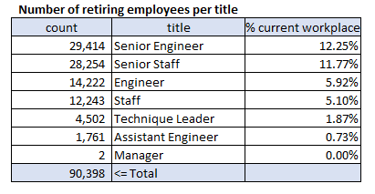
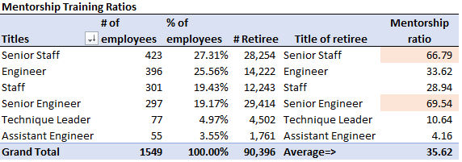

 # Pewlett-Hackard-Analysis

## Project Overview
Using ERD as a reference, we created a Retirement Titles table that holds all the titles of the current employeed who will retire from the company.\
Using PostgreSQL we analyzed Pewlett Hackard databese to help the company anticipate the "silver tsunami" as many current employees will leave to retirement.\
For this analysis we will:
1. Deliverable 1 - Determine the number of retiring employees per title,
2. Deliverable 2 - Identify the employees eligible to participate in a Mentorship Program.

## Resources
- Data Source: [departments.csv](https://github.com/vachoa/Pewlett-Hackard-Analysis/blob/master/Data/departments.csv), [dept_manager.csv](https://github.com/vachoa/Pewlett-Hackard-Analysis/blob/master/Data/dept_manager.csv), [dept_emp.csv](https://github.com/vachoa/Pewlett-Hackard-Analysis/blob/master/Data/dept_emp.csv), [employees.csv](https://github.com/vachoa/Pewlett-Hackard-Analysis/blob/master/Data/employees.csv), [salaries.csv](https://github.com/vachoa/Pewlett-Hackard-Analysis/blob/master/Data/salaries.csv), [titles.csv](https://github.com/vachoa/Pewlett-Hackard-Analysis/blob/master/Data/titles.csv)
- Software: PostgreSQL 11.9, pgAdmin 4\
Documentation: [PostgreSQL documentation](https://www.postgresql.org/docs/manuals/), [PostgreSQL tutorial](https://www.tutorialspoint.com/postgresql/), [pgAdmin documentation](https://www.pgadmin.org/docs/)

## Results

### Number of retiring employees per title
Using the [ERD](https://github.com/vachoa/Pewlett-Hackard-Analysis/blob/master/EmployeeDB.png) created previously, we were able through SQL relationships generate a list of retirees/
  

  

 

The following Retirement Titles table was created and it holds all the titles of employees who were born between January 1st, 1952 and December 31st, 1955.
  

  

 
 	
- 90,398 employees or 37.65% of the company's total current employees (240,124)  will be retiring soon.
- Senior Engineer, Senior Staff and Engineer will be the most impacted positions with respectively 29,414, 28,254 and 14,222 futures retirees, which correspond to 12.3%, 11.8% and 5.92% of the company's workforce.
- Fortunately, only 2 Managers will be retiring soon.\
It seems that management renewal has been to focus of the company to the detriment of technical positions renewal.   

### Employees eligible for the mentorship program
Using the [ERD](https://github.com/vachoa/Pewlett-Hackard-Analysis/blob/master/EmployeeDB.png) created previously, the following Mentorship Eligibility table was created and it holds all the current employees who were born between January 1st, 1965 and December 31st, 1965.
  

  
 
  Extract of the mentorship eligibility table 

 

- There are 1,549 employees eligible to participate in the mentorship program.
- 423 Senior Staffs, 396 Engineers, 301 Staffs and 297 Senior Engineers are eligbible mentors.
  

## Summary
- 90,398 roles will need to be filled as the "silver tsunami" begins to make an impact.
- There are 1,549 eligible mentors in the company.\
 Assume that Pewlett-Hackard will replenish all the retirees.  Assuming that they will all be willing to participate in the mentorship program, we created a table of Mentorship ratio,  and we can clearly see that there is a huge challenge for Senior Staff and Senior Engineer, so we can conclude that there is not enough mentors to prepare the next generation of Pewlett Hackard employees.
 - The following tables give us the number of retirement-ready employees and the number of eligible mentors per department. It illustrates that most of the departments have a high ratio of mentees to mentors.  

- Reviewing the criteria to qualify for the mentorship program would be needed (in order to increase the amount of mentors) by the company to prepare for the coming "silver tsunami".
- Further, from the table as follows, we can see that retirees have an average 28 years of service for Pewlett Hackard, experiences that is very valuable, and the entity should persuade retirees to enroll on the mentorship program.

Table - Mentorship Eligibility Table -
with years of service for Pewlett-Hackard
